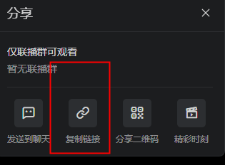

# 下载钉钉视频  <br>
### 必要条件 <br>
* Chrome浏览器 <br>
* [ffmpeg](https://ffmpeg.org/download.html)<br><br>
1. 获取视频分享链接  <br>
<br>
2. 下载视频  <br>
在main目录下执行<br>
``` go run main.go -type "video" -url "https://n.dingtalk.com/dingding/live-room/index.html?roomId=oiPzbfYe1oANm42n&liveUuid=09bd1176-fff2-4a51-9677-1ecf436ebe48" ```<br>


#### golang 依赖下载失败时可以修改为国内镜像再次尝试: <br>
```setx GOPROXY "https://mirrors.aliyun.com/goproxy"```<br>